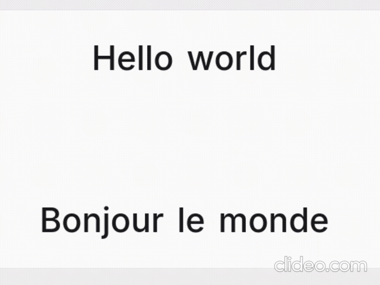
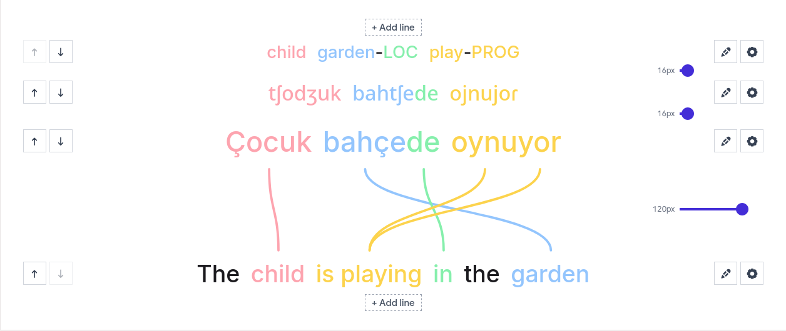
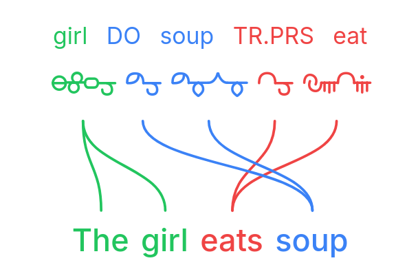
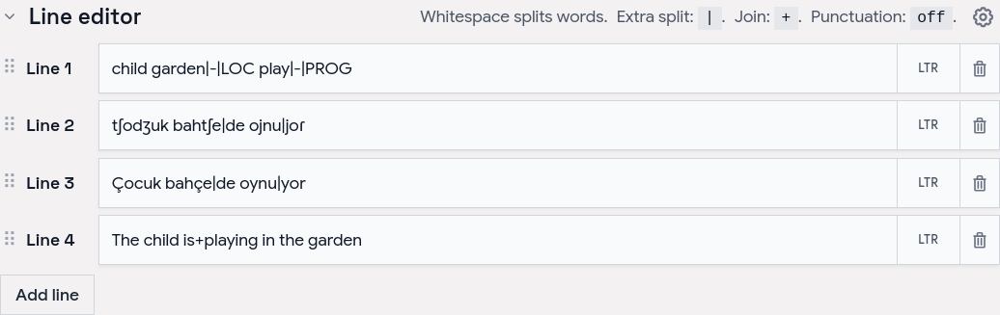
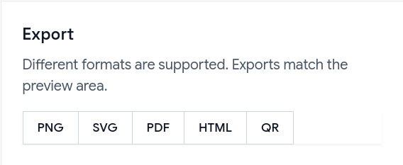

# Aligner — word-by-word translation visualizer

**[aligner.tinygods.dev](https://aligner.tinygods.dev)**

Word Aligner is a free web tool that shows **which word matches which** across stacked lines of text. Type or paste a sentence and its translation, click a word and then its match on the line above or below, and curved connectors draw the alignment between them. Add extra rows for **glosses** or **IPA**, then **export** the diagram or **share** it with a link.

No accounts, no machine translation — you stay in control of every link. Great for lessons, social posts, grammar notes, and conlang documentation.

## What it's for

- **Language learners** — see exactly why a translation says what it does: which source word became which target word, what gets dropped, and where word order changes.
- **Teachers** — build handouts, slides, and flashcards; export a clean PNG or SVG and drop it into a lesson without retyping anything.
- **Linguists** — produce Leipzig-style interlinear glosses with morpheme alignment, case/agreement tags, and free translations.
- **Conlangers** — show how a constructed language maps onto English, with custom script fonts, gloss rows, and IPA.

## What it does

- **Multi-line alignment** — stack as many rows as you need (source, translation, gloss, IPA); links connect vertically adjacent lines.
- **Manual word linking** — click a word, then its match; supports one-to-many and many-to-one links and freely crossing connectors for reordered translations.
- **Interlinear glosses & IPA** — add annotation tiers above or below any line.
- **Right-to-left scripts** — Hebrew, Arabic, and mixed LTR/RTL layouts.
- **Tokenization control** — choose how text splits into word boxes (split characters, a join marker for fixed expressions, optional punctuation handling).
- **Per-line typography** — font, size, spacing, and direction per line; custom and Google Fonts.
- **Exports** — PNG, SVG, PDF, and a self-contained HTML file; exports match the preview, including custom-font shaping.
- **Shareable URLs** — the whole alignment (text, links, and visual settings) is encoded in a `?data=` link.

## Examples

Browse ready-made examples — bilingual pairs, Turkish interlinear with IPA, RTL scripts, Tagalog compounds, Japanese–Chinese–English word order, and more interlinear glosses — at **[aligner.tinygods.dev/examples](https://aligner.tinygods.dev/examples)**. Open any one in the editor to adapt it.

## How it works

Edit your lines in the line editor, then link words in the preview.

Tune colors, tokenization, and fonts in settings, then export or share.

## Word alignment vs. interlinear vs. parallel text

- **Interlinear translation** places a gloss directly under each source word — compact, but it hides reordering. Aligner keeps both sentences on their own line and draws connectors, so reorderings, splits, and merges stay obvious.
- **Parallel text** is side-by-side bilingual reading for long-form study. Aligner focuses on one sentence pair at a time with explicit connectors showing which tokens correspond.

## Learn more

- **App:** [aligner.tinygods.dev](https://aligner.tinygods.dev)
- **About / documentation:** [aligner.tinygods.dev/about](https://aligner.tinygods.dev/about)
- **Privacy:** [aligner.tinygods.dev/privacy](https://aligner.tinygods.dev/privacy)

Created by Dani Polani. See other [tools for linguistics and conlanging](https://danipolani.github.io/en/blog/tools/).
